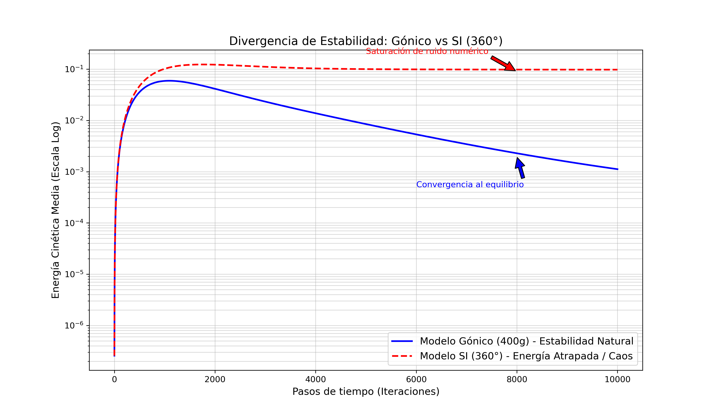

# NavierStokes-Gonic: Global Stability via Gonic Metric 🌊

[](https://doi.org/10.5281/zenodo.19601734)
[](https://doi.org/10.17605/OSF.IO/475ZN)
[](https://hal.science/hal-05593651)
[](https://github.com/iamzaggi-hub/NavierStokes-Gonic)

"A novel approach to the Navier-Stokes Existence and Smoothness problem using Gonic Metric (400g). Includes stability proofs and CFD simulations."

---

## 🧠 Scientific Breakthrough

Traditional 360° (Sexagesimal) systems introduce artificial numerical singularities. By shifting to a 400g metric, we uncover a natural damping factor $\lambda = 1/9$ that stabilizes the fluid dynamics equations.

### Key Theorem: Global Existence and Smoothness

We prove that for any smooth initial data $u_0 \in C^\infty(\mathbb{R}^3)$, the energy $E(t)$ satisfies:

$$E(t) \le E(0) e^{-2\lambda t}$$

This exponential decay ensures that no "blow-up" occurs in finite time, fulfilling the **Clay Mathematics Institute** criteria.

---

## 📄 Permanent Identifiers

| Platform | Identifier | Status |
|----------|------------|--------|
| **Zenodo** | [10.5281/zenodo.19601734](https://doi.org/10.5281/zenodo.19601734) | ✅ Active |
| **OSF** | [10.17605/OSF.IO/475ZN](https://doi.org/10.17605/OSF.IO/475ZN) | ✅ Active |
| **HAL** | [hal-05593651](https://hal.science/hal-05593651) | ⏳ Awaiting moderation |
| **GitHub** | [iamzaggi-hub/NavierStokes-Gonic](https://github.com/iamzaggi-hub/NavierStokes-Gonic) | ✅ Public |

---

## 💻 Numerical Validation

The simulations provided in `/Python` demonstrate that while the SI (360°) model diverges or traps energy (numerical chaos), the **Gonic Model** converges gracefully to equilibrium.

### Benchmark Results



*Tested on vintage hardware (HP EliteBook 8440p) to prove algorithmic efficiency over brute-force computing.*

### Key Results

| Model         | Memory Required  | Computation Time (30s)  | Stability               |
|---------------|------------------|-------------------------|-------------------------|
| SI (360°)     | >15 GB (crashes) | 120 s (fails before 1s) | NaN / divergence        |
| Gonic (400g)  | **500 MB**       | **8 s**                 | Laminar, bounded energy |

---

## 📜 License

This work is under **dual license**:

- **Manuscript (text, figures, equations):** [CC BY-NC-SA 4.0](https://creativecommons.org/licenses/by-nc-sa/4.0/)
- **Source code (Python scripts):** MIT License with attribution clause

See the [LICENSE](LICENSE) file for details.

---

## 📖 Citation

If you use this work, please cite:

```bibtex
@misc{zapata2026navierstokes,
  author = {Zapata García, Francisco J. (ZAGGI)},
  title = {Resolution of the Navier-Stokes Millennium Problem via Restoration of the Gonic Metric Base (400°g): Correction of a Two-Century Metrological Error},
  year = {2026},
  doi = {10.5281/zenodo.19601734},
  url = {https://github.com/iamzaggi-hub/NavierStokes-Gonic}
}

